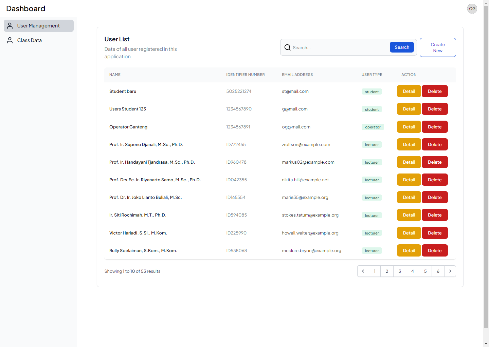
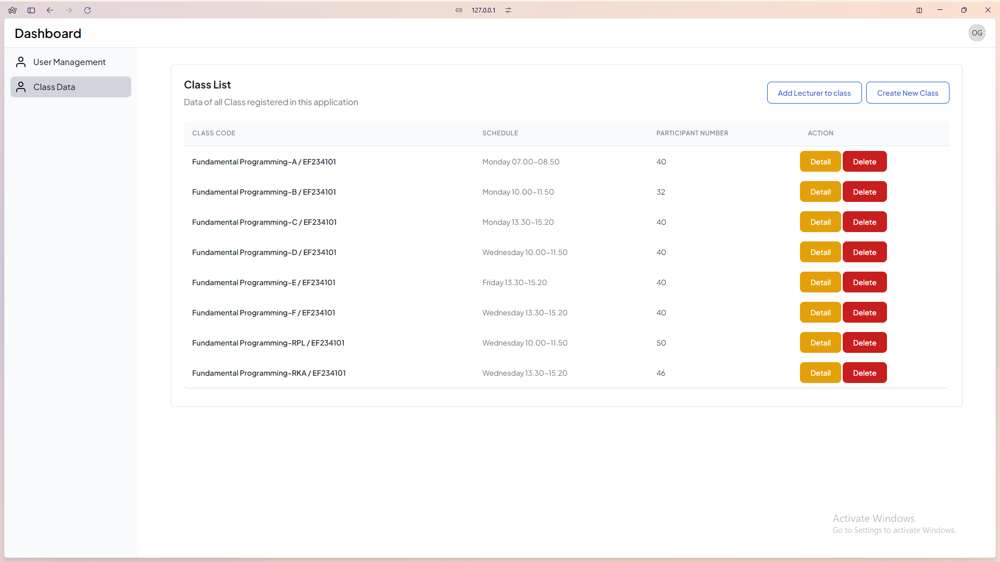

# Midterm Project Framework Programming D ITS 24/25

## Anggota Kelompok

| Nama                    | NRP        |  
|-------------------------|------------|
| Muhammad Iqbal Ramadhan | 5025221274 |
| Arya Gading Prinandika  | 5025221280 |

## Judul Aplikasi

Sistem Informasi Asisten Dosen Terpadu **(SiAsdosPadu)**

## Database Model (PDM)

## Tampilan UI dari Aplikasi

- Homepage

- Dashboard untuk Operator yang menampilkan semua data user

- Dashboard untuk Operator yang menampilkan semua data kelas
- 

## Deskripsi singkat Aplikasi

Aplikasi yang kami buat merupakan sistem manajemen untuk pendaftaran sebagai Asisten Dosen di Teknik Informatika ITS
pada aplikasi ini terdapat 3 User Role yaitu `Student` `Lecturer` `Operator`. Dengan masing masing role mempunyai peranan sebagai berikut:

### Student
Student dapat register pada aplikasi, kemudian setelah registrasi akun maka dapat melihat data semua kelas yang ada. Student dapat memilih kelas yang diinginkan,
untuk pendaftaran sebagai asisten dosen perlu untuk Student memasukkan beberapa input seperti IPK, apakah bersedia hadir, apakah mendapatkan rekomendasi dan juga bukti rekomendasi jika ada.
Setelah berhasil mendaftar maka student perlu menunggu untuk registrasi sebagai asisten dosennya diterima atau tidak. Student dapat melakukan submisi ke beberapa kelas.

Jika student memiliki data dimana registrasinya diterima maka student dapat mengisi log book kegiatan sebagai asisten dosen, yang akan disetujui oleh lecturer atau pengajar dari kelas tersebut.

### Lecturer

Lecturer pada aplikasi ini hanya terbatas pada menerima asisten dosen dan memverifikasi log yang dikirimkan dari asisten dosen kelas yang diampu.

### Operator

Operator pada aplikasi ini memiliki peranan untuk mengelola data master yang diperlukan dalam aplikasi ini.  Operator dapat melakukan proses CRUD pada data user dan juga data Kelas beserta dengan pengajarnya.
Operator tidak dapat melihat atau melakukan verifikasi atas semua data asisten dosen.

## Database Relationship

Sesuai dengan gambar PDM (Database model) yang telah dicantumkan, pada aplikasi ini terdapat beberapa relationship seperti one-to-many dan juga many-to-many. Untuk relasi many-to-many ada pada tabel `Users` ke tabel `Course Class`
dan menggunakan sebuah pivot table yang bernama `Lecturers`. Untuk lebih lengkap dapat mengecek relationship yang dibuat di [sini](app/Models)

## YouTube Video

Untuk video youtube dapat dilihat pada link berikut: [Video YouTube]()

